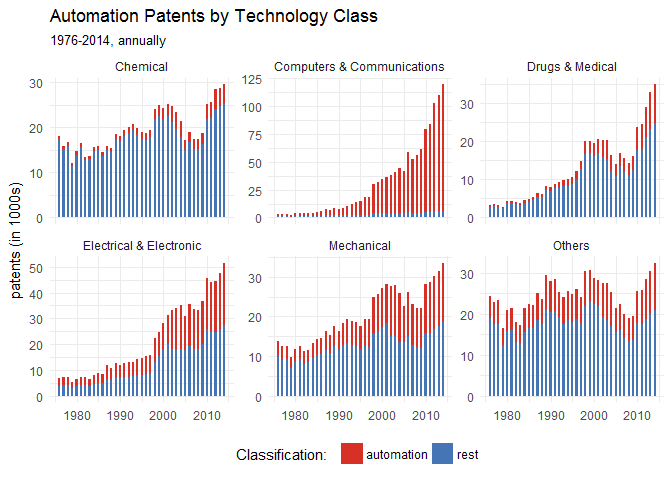
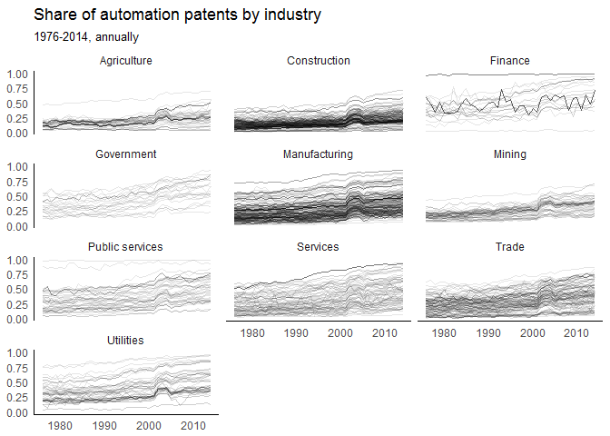

Exploring Automation Patents
================
Katja Mann, Lukas Püttmann
2 June 2018

We provide some codes here, to explore the datasets we provide in our paper. You can cite this document as:

> Mann, Katja and Lukas Püttmann (2018). "Exploring Automation Patents". Online at: <https://github.com/lpuettmann/automation-patents>.

Load some packages:

``` r
library(tidyverse)
```

    ## -- Attaching packages ------------ tidyverse 1.2.1 --

    ## v ggplot2 2.2.1     v purrr   0.2.4
    ## v tibble  1.4.2     v dplyr   0.7.4
    ## v tidyr   0.8.0     v stringr 1.3.0
    ## v readr   1.1.1     v forcats 0.3.0

    ## -- Conflicts --------------- tidyverse_conflicts() --
    ## x dplyr::filter() masks stats::filter()
    ## x dplyr::lag()    masks stats::lag()

Get the two patent datasets and combine them:

``` r
hjt <- patents %>% 
  group_by(year, hjt, automat) %>% 
  summarise(patents = n()) %>% 
  mutate(classification = case_when(
    automat == 1 ~ "automation",
    automat == 0 ~ "rest"))

ggplot(hjt, aes(year, patents, fill = classification)) +
  geom_col(width = 0.5) +
  facet_wrap(~hjt, scales = "free_y") +
  theme_minimal() +
  scale_y_continuous(labels=function(x) x / 1000) +
  labs(y = "patents (in 1000s)", x = NULL, subtitle = "1976-2014, annually", 
       fill = "Classification:  ", title = "Automation Patents by Technology Class") +
  theme(legend.position = "bottom") +
  scale_fill_manual(values = c("#d73027", "#4575b4"))
```



Industries
==========

Get the industry data:

``` r
ind <- read_csv("data/industry_data.zip") 
```

    ## Parsed with column specification:
    ## cols(
    ##   year = col_integer(),
    ##   sic1 = col_integer(),
    ##   sic1_name = col_character(),
    ##   sic = col_integer(),
    ##   nb = col_character(),
    ##   affil = col_character(),
    ##   weight = col_character(),
    ##   owner = col_character(),
    ##   patents = col_double()
    ## )

Pick the versions of the data we're interested in: 1) where are patents used (not invented) and 2) patents not weighted by the number of their citations. The data comes split into bins for individual patent owners. So to get a first look at the data, sum over all patent owners:

``` r
df <- ind %>%
  filter(affil == "sector of use",
         weight == "none") %>%
  group_by(year, sic1, sic1_name, sic, nb) %>% 
  summarise(patents = sum(patents)) 
```

Now, calculate the share of patents in industries that are automation patents:

``` r
df <- df %>% 
  spread(nb, patents) %>% 
  mutate(sh = automation / (automation + rest))
```

Plot the share of automation patents for all industries:

``` r
ggplot(df, aes(year, sh, group = sic)) +
  geom_line(alpha = 0.1) +
  labs(title = "Share of automation patents by industry",
       subtitle  = "1976-2014, annually",
       x = NULL,
       y = NULL) +
  theme_minimal() +
  theme(axis.line = element_line(colour = "black"),
        panel.grid.major = element_blank(),
        panel.grid.minor = element_blank(),
        panel.border = element_blank(),
        panel.background = element_blank()) +
  facet_wrap(~sic1_name, ncol = 3)
```

    ## Warning: Removed 17 rows containing missing values (geom_path).



There are many more subindustries in *Manufacturing* and *Services* than in *Finance* or *Government*, that's why the plots are darker and denser.

The share of all patents that we classify as automation has risen across industries. But there's quite a bit of heterogeneity across industries.

The bump around 2002-2004 corresponds to a change in the files provided by [Google](https://www.google.com/googlebooks/uspto-patents-grants-text.html). This probably means that some category of patents was in the files but not before or after. If you know something about what changed around those dates, please let us know!

We were worried that this might be due to an error in our parsing of the patent files, but that does not seem to be the case.

To check whether this is a problem, we scraped data from the USPTO website and compared our aggregate counts per year and technological class with those in our dataset. There's nothing special about 2002 to 2004 from which we conclude that this "bump" in the data is something that is already contained in the original data from the patent office. This might be due to some change in the eligibility criteria for which innovations can be protected with a patent or it could be do to the way that the USPTO publishes patents or structures their data.

In any way, we recommend to be cautious in interpreting changes around these years as reflecting underlying technological trends. In our own empirical analysis, we use five year moving sums of patents.
